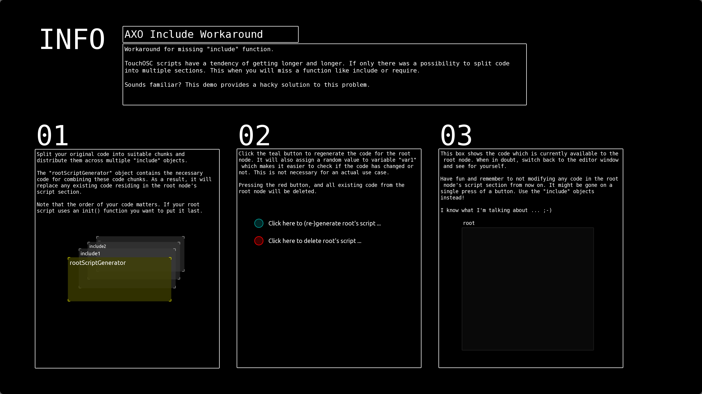

# AXO Include Workaround

Workaround for missing "include" function.
TouchOSC scripts have a tendency of getting longer and longer. If only there was a possibility to split code into multiple sections. This when you will miss a function like include or require.
Sounds familiar? This demo provides a hacky solution to this problem.

## Step 01:

Split your original code into suitable chunks and distribute them across multiple "include" objects.
The "rootScriptGenerator" object contains the necessary code for combining these code chunks. As a result, it will replace any existing code residing in the root node's script section.
Note that the order of your code matters. If your root script uses an init() function you want to put it last.

## Step 02:

Click the teal button to regenerate the code for the root node. It will also assign a random value to variable "var1" which makes it easier to check if the code has changed or not. This is not necessary for an actual use case.
Pressing the red button, and all existing code from the root node will be deleted.

## Step 03:

Have fun and remember to not modifying any code in the root node's script section from now on. It might be gone on a single press of a button. Use the "include" objects instead!
I know what I'm talking about ... ;-)
