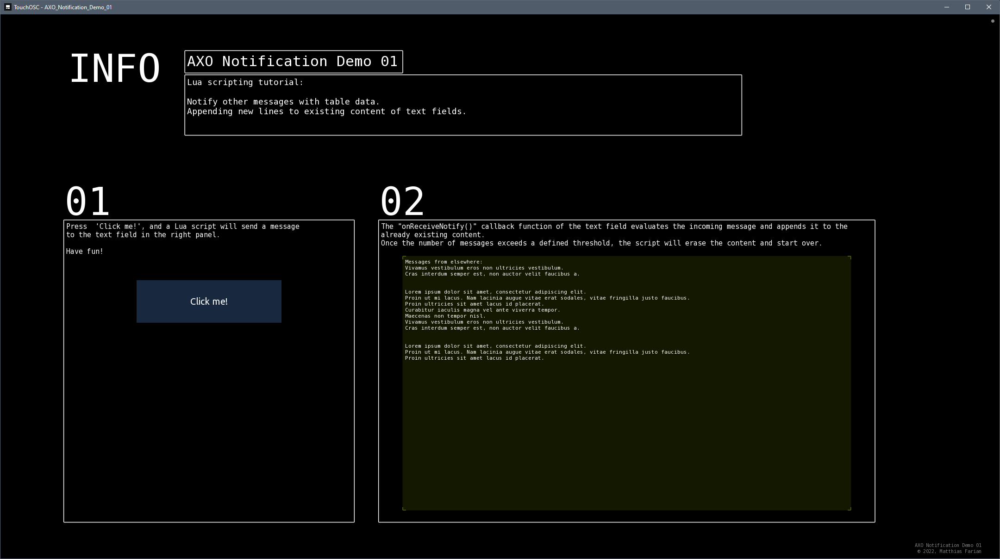

# AXO Notification Demo 01
Lua scripting tutorial:
* Notify other messages with table data.
* Appending new lines to existing content of text fields.

## 01
Press  'Click me!', and a Lua script will send a message
to the text field in the right panel.

## 02
The "onReceiveNotify()" callback function of the text field evaluates the incoming message and appends it to the already existing content.
Once the number of messages exceeds a defined threshold, the script will erase the content and start over.

